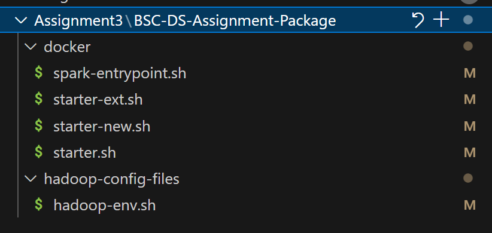
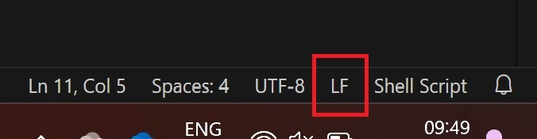

# Assignment 3

## Overview of the required setup

In this document we will describe the infrastructure and toolchain that you will require for tackling Assignment 3. There are two major chunks of infrastructure that you need to setup: (1) A Java development environment where you can create and test the programs for each of the tasks, and (2) a simulation of a computing cluster through multiple virtual machines that will run on your PC/Laptop. Once you have these, your workflow would then involve:

- Using the templates to complete your program and test each task in the self-contained environment of your Java project
- Deploy the compiled program on a cluster (which is actually a set of Docker virtual machines running on your laptop)
- (Of course, update your Git branch as you keep finishing tasks)
- In the report.md file, provide answers to the questions posed in the assignment sheet
- For each task include the Spark execution log (more on this later)
- When you are ready to submit, push to the main branch of your private fork


But first, lets get started with setting up of the development environment.

## The usual step - fork this repository

As with the previous assignments, create a private fork of this repository and clone it to your local repo (i.e. on your laptop). The key folders and files you will have to deal with are:

```docker-containers``` : This contains the scripts to pull and initialized the required containers.
```java-project``` :  This is the Java project that you can load in to VSCode, IntelliJ, etc. and use for your development.
```datasets``` : This is where you can place the dataset files (see next step)

**Important note for Mac users:**  There are a bunch of shell scripts in the ```docker-containers\docker``` folder. You need to enable execute (``x``) permission on these. You can do this by opening a shell terminal and ``cd`` to ```<repo root>>\docker-containers\docker``` and doing ```sudo chmod 777 *.*```.


**Important note for Windows users: Ensure line endings of the startup script**

[Line endings on Windows and Unix are different.](https://stackoverflow.com/a/426404). Some files are mounted into the container and must be executable there. This is not possible, if the line endings do not match. To ensure that they do, open the folder that contains the assignment package in your IDE, e.g. in VS Code (see Figure 1). Check the line endings symbol and click on it _if it shows_ `CRLF` and set it to `LF`  (see Figure 2). Save all files.



_Figure 1:_ Files that need adjustment



_Figure 2:_ Symbol to toggle the line endings in VS Code


## The unusual step - copy the dataset files

Go to this [Google drive folder](https://drive.google.com/drive/folders/11q780aUVYPd0C4EV9Ci9LqYL8jrhdJTh?usp=sharing) while being logged using you unisg account. Copy the ```*.csv``` files to your local ```datasets``` folder.

## Setting up the Java Development Environment

As a prerequiste, you need to install a Java Development Kit (you might have already done this). It is a framework that provides compilers and standard libraries to enable you to write programs in Java language. Here, we are restricted to using Java JDK 17 because (unfortuantely) Apache Spark doesnt work with the latest JDK (21). You can find the step-by-step instructions [here](installing-jdk.md).

If everything is good, then opening your Command Prompt / Terminal and typing ```java -version``` should confirm with something like ```Java JDK 17```. If not, contact a TA for assistance.

Now, for the development environment (IDE) itself, you have endless choices. We will support VSCode and IntelliJ (but we are quite sure that others will work too). Choice is yours. For VSCode, simply install the [Java Build Tools](https://code.visualstudio.com/docs/java/java-build) extension. If you would like a bit more elaborate environment, you can try [IntelliJ Community Edition](https://www.jetbrains.com/idea/download/?section=windows). We dont hold stocks in either of the companies, so these are just a suggestion.

Once you have installed your favourite IDE, simply open the project folder ```java-project```. VSCode and IntelliJ will automatically take care of processing the dependencies listed in the Maven configuration file ```pom.xml``` (Maven is a tool that manages packages and builds in Java).

To test if everything is ok, simply run the Main class (which is the default) and you should see the following the message in the debug console. 

`Congratulations! You have run your first Spark application in local mode`

Once again, in case of trouble, hit the TA button.

Thats it. You are now ready to code. But since you will soon need a cluster to try out, we recommend you follow the next chunk of instructions so that you have everything ready in one go.

## Spark Cluster Using Docker

### Step 1: Install Docker

Install Docker by following the instructions of the official documentation [here](https://docs.docker.com/get-started/introduction/get-docker-desktop/). If everthing goes well, you should be able to see an application called Docker Desktop installed. This is a GUI that will allow you to manage your containers.

### Step 2: Create a virtual network

Applications running inside the containers can communicate with one another over a virtual network.  All containers of the cluster as well as the host will connect to this network. Run the following command (in a shell terminal) to create a network named A3:

```bash
docker network create --gateway 172.23.0.1 --subnet 172.23.0.0/16 A3
```

This step needs to be done only once. The network lives on even when you shutdown the containers.

**Linux users:** Depending on your user policy, you may have to use ```sudo``` before all ```docker``` commands. You will know this when the command without elevation fails with insufficient permission error.

**Mac users:** In the unlikely event of this command failing with some cryptic reason, try restarting the Docker engine. You will find the menu at the bottom left part:


## Step 3: Pull the containers and run it

We have provided scripts for pulling the pre-configured containers from remote repositories and re-configuring them to suit our needs. There are 7 containers to reckon with: 2 Hadoop (distributed storage) related, and 5 Spark (distributed execution) related ones. First, lets get the containers:

In the terminal `cd` to the `<repository root>\docker-containers` and execute:

```bash
docker compose -f docker-compose.hadoop.yaml -f docker-compose.spark.yaml up --force-recreate
```

This will take at least few minutes. Once it is done, you can start the Docker Desktop GUI (you can skip login)


 and then you can see the containers:


The figure below shows what these containers are:


Each of the containers represent a node in our desired distributed cluster. The `Spark Client` is a convenience node - you will terminal in to this node and then command/query the `Spark Master`. Think of it as your gateway to the master. The `HDFS namenode` manages the file system organization while the `HDFS datanode` is the one which manages the storage and makes data available to the clients. The `Spark Master` is the one which is going to analyze your application and plan an execution. It then instructs the `Spark Workers` to work on a specified partition of the data. In your code whenever you want to access a file, you just point to a file namespace on the `HDFS namenode` and at run time the workers will know from the namenode where exactly (i.e., the datanode) to fetch the data from. For example, you can simply refer to ```hdfs://namenode:9000/datasets/dataseet-word-count.txt``` and not be worried from which disk/network node to fetch the data from. In real life setups there are often multiples of datanodes which may have different network distance to the workers --here the namenode will tell the worker which datanode is best for its purpose.

You can interact with the management applications of Hadoop and Spark which provide browser-based control panels. Lets first look at what Hadoop is doing and then peek in to Spark.

### Visit the HDFS WebUI

There are two Hadoop nodes: the namenode which manages distribution and access of data, and the datanode where data is stored and made available to the clients. When requiring to access file resources, clients address the namenode which then transparently redirects the clients to the nearest/best datanode. You can inspect these two nodes by accessing the following URLs using a browser running on the host (i.e. your laptop):

- Hadoop Namenode: <http://localhost:9870> : Here you will see the list of datanodes and also a GUI to manage the file system.

- Hadoop Datanode: <http://localhost:9864> : Here you get to know what the datanode is storing.

#### Interact with Hadoop

We will use the Hadoop storage infrastructure to make available the compiled Java program (i.e., the jar file) to the Spark master as well as for making the datasets accessible to the programs running in the workers. You can supply the required files (we will later explain which) to Hadoop through the management console GUI.

Go to `http://localhost:9870`, and then in the upper right corner go to `Utilities->Browse the file system`. Use the Buttons `Create Directory`, `Upload Files`, `Cut & Paste` and `Parent Directory` to interact with the file system. Notice that you dont really need to interact with the datanode(s). The namenode will handle the distribution automatically. If you wish, you can examine the datanode's dashboard (<http://localhost:9864>) to see what happened to the files you supplied.

#### Visit the Spark WebUI

- Spark Master: <http://localhost:8085> : This where all the planning and distribution of tasks happen.
- Spark History Server: <http://localhost:18085/>: Once an application is done (sucessfully or with errors), you can go here and examine the execution history.

We will be using these WebUIs extensively to look in to Spark's operation.

#### Stopping the Docker Containers

_Note:_ once you stop the containers (or shutdown your laptop), the files you uploaded are lost. At this point, you should not have valuable files there. If you do, download the file via the Hadoop namenode WebUI (<http://localhost:9870>).

To stop the containers, you have three options:

1. In the terminal you started the containers, press `CTRL+C`. A container shutdown process will be invoked.
2. In the directory `BSC-DS-Assignment-Package`, open a new terminal and run `docker compose -f docker-compose.spark.yaml down` and then `docker compose -f docker-compose.hadoop.yaml down` 
3. Use the Docker Desktop UI and hit the stop button

_But remember:_ to restart the containers **only** use the command:

```bash
docker compose -f docker-compose.hadoop.yaml -f docker-compose.spark.yaml up --force-recreate
```

_Note:_ If you try to restart the containers using the Docker Desktop GUI or using  

```bash
docker start <container-name>
```

you will notice that the container for `datanode` fails to start. This is unfortunately the way the containers operate -- the state of synchronization between the `namenode` and `datanode` is lost during container shutdown. But for our purpose, we are good restarting the containers with the ```--force-recreate``` option, which reconstructs the containers afresh.

## Development Workflow

In the cloned repository, you will find a folder ``java-project``. Open this in your IDE. If it is the first time, be patient - the IDE will fetch dependencies and build the project. This can take few minutes. Worth a tea/coffee/tap-water. In the project explorer, for each of the tasks you will see a correponding class along with an example introductory code, and a "playground" code. These are:

`TaskExampleShowering.java` : This file contains a program for simple statistical analysis of showing telemetery data (dataset-showering.csv). This is only an example for you to play around with and understand how Spark datasets are constructed and worked with.

`TaskWordCount.java, TaskRoomSensorTelemetry.java, TaskKMeans.java`: These are the skeleton code for implementing your tasks mentioned in the assignment sheet.

What you need to do is to complete the program in each of the respective classes. The program can be invoked through the static ```run``` method which has a single boolean parameter called ```local```. For example, to run the word count program in local mode, you will have in the `Main` class the following code:

```java
    public static void main(String[] args) {
        try {
            TaskWordCounting.run(true);
        } catch (Exception e) {
            throw new RuntimeException(e);
        }
    }
```


By setting ```local``` to ```true``` you will cause the program to fetch the dataset from your local folder (i.e., in ```<repo root>\datasets``` folder). By setting to ```false``` you will ask the program to fetch it from ```hdfs://namenode:9000/datasets``` "folder".

Once you are satisfied that your program is working fine, you can proceed to deploy it on the Docker container-based cluster. You have to follow few steps to do this:

### Cluster deployment - Step A: Copy the dataset files

Use the HDFS dashboard (<http://localhost:9870>) to copy the *.csv files rom your local folder to the HDFS storage. Hadoop will make these files accesible to the Spark nodes. You need to copy the dataset files _each time_ you restart the HDFS nodes (i.e, they are not persisted across restarts).

### Cluster deployment - Step B: Compile a jar file

Once you are happy that your program is working in the local mode, you are ready to try it out on the "cluster".

_Important:_ Make sure to change the parameter ```local``` to ```false```. This will now cause your program to try and fetch the dataset from the Hadoop file storage.

For example:
```java
    public static void main(String[] args) {
        try {
            TaskWordCounting.run(false); //<-- setting to false will cause the program to try and fetch 
                                         //    the dataset from hdfs (i.e. hdfs://namenode/datasets folder)
        } catch (Exception e) {
            throw new RuntimeException(e);
        }
    }
```

You need to create an executable file of the Java program - this is called as the ```jar``` export. The process of exporting packages essential libraries in to the jar file.  The steps to do this depends on the IDE you are using.

**IntelliJ users:** Go to File -> Project Structure. On the left pane select Artifacts, and on the right page click on the add (+) button. Select the main class. Close the dialogs. Go to Build->Build Artifacts and select the jar to build. The jar file should be created in the output folder

**Important note for IntelliJ users:** IntelliJ signs the jar files which can cause problems depending on the JDK that you use. The solution to this is to remove two files: ```META-INF/DUMMMY.SF and META-INF/DUMMY.DSA```. Mac and Linux user can do this by running

```bash
zip -d file.jar 'META-INF/*.SF' 'META-INF/*.DSA'
```

Windows users need to install [7Zip](https://www.7-zip.org/), and then use the 7Zip file manager to manually delete these two files.


**VSCode users:** Use the command (```Ctrl+Shift+P```) ```Java: Export jar``` to create the jar file. (See [here](https://code.visualstudio.com/docs/java/java-project#_export-to-jar))

### Cluster deployment - Step C: Upload the jar file to HDFS

Spark relies on HDFS to host all files relevant to the application. That includes `.jar` files that implement application, input files and output files.

1. Upload your generated `jar` to HDFS `/jars` folder.
2. Open the bash shell of the `spark-client` container by executing this in a new terminal: ```docker exec -it spark-client bash```
3. Submit the application by calling the spark-submit command:

    ```bash
    spark-submit --deploy-mode cluster --class org.example.Main --master spark://spark-master:7077 hdfs://namenode:9000/jars/<your-jar-file-name>.jar
    ```
You should see some trace messages which tells that the application has been submitted to the Spark master for execution:

```
INFO ClientEndpoint: Driver successfully submitted as driver-20251003090505-0002
INFO ClientEndpoint: State of driver-20251003090505-0002 is RUNNING
INFO ClientEndpoint: Driver running on 172.23.0.13:7083 (worker-20251002113953-172.23.0.13-7083)
INFO ClientEndpoint: spark-submit not configured to wait for completion, exiting spark-submit JVM.
INFO ShutdownHookManager: Shutdown hook called
```

PS: Do not be disappointed that you dont see the results of the execution as you did in the local deployment :). We are coming to that...

4. But, congratulations! You submitted your first job. Now use the WebUI of the Spark master (<http://localhost:8085/>) to explore what has happened:


The UI informs you that three worker nodes available to the master. Further down:


You see that the application you have submitted has been completed by the driver. Very good! Now, we will go on to examine what happened during the execution.

## Analyzing Spark's execution of the application

Spark provides and extensive log of it execution which can be viewed from its History Server (<http://localhost:18085>). You can view the log of any of the application submitted in the past (of course, since the container restart):


When you examine an application history, you can identify the jobs, stages, tasks, and their executors:


An extensive documentation of the information available through the History Server is beyond the scope of this readme. Refer to the Spark [documentation](https://spark.apache.org/docs/latest/monitoring.html). This YouTube [video](https://youtu.be/iXVIPQEGZ9Y?si=rw8CN_p0GtURMDEK) offers an excellent walk-through of how Spark execution works and how you can interpret the history.

**Remember** to download the execution history log file and add it to the ```logs``` folder of your repository. Rename the logfile to be ```Task-<1/2/3>-log.zip``` (example ```Task-1-log.zip```).

