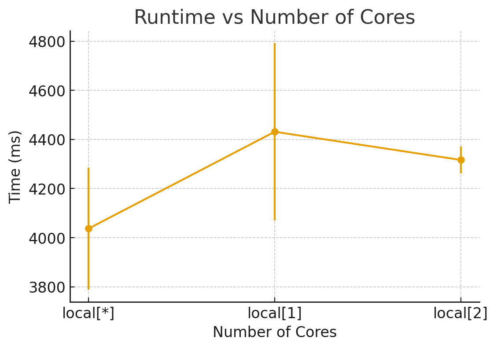

# Assignment 3 Report

## Team Members

Please list the members here

## Responses to questions posed in the assignment

_Note:_ Include the Spark execution history for each task. Name the zip file as `assignment-3-task-<x>-history.zip`.

### Task 1: Word counting

1. If you were given an additional requirement of excluding certain words (for example, conjunctions), at which step you would do this and why? (0.1 pt)

I would exclude them after the flatMap step inside the WordMapper function, because at this stage the words have already been split into individual tokens. 
This allows for efficient filtering of unwanted words before they are counted, reducing the amount of data that needs to be processed in subsequent steps.

2. In Lecture 1, the potential of optimizing the mapping step through combined mapping and reduce was discussed. How would you use this in this task? (in your answer you can either provide a description or a pseudo code). Optional: Implement this optimization and observe the effect on performance (i.e., time taken for completion). (0.1 pt)

Spark provides a built-in function called `combineByKey` that can be used to optimize the mapping and reducing steps. Instead of performing a separate map and reduce operation, we can combine them into a single step.
Here is a pseudo code example of how this can be implemented:
JavaPairRDD<String, Integer> counts = words
.mapToPair(word -> new Tuple2<>(word, 1))
.reduceByKey((a, b) -> a + b); // combines map & reduce

3. In local execution mode (i.e. standalone mode), change the number of cores that is allocated by the master (.setMaster("local[<n>]") and measure the time it takes for the applicationto complete in each case. For each value of core allocation, run the experiment 5 times (to rule out large variances). Plot a graph showing the time taken for completion (with standard deviation) vs the number of cores allocated. Interpret and explain the results briefly in few sentences. (0.4 pt)

| Number of Cores | Average Time (ms)      | Standard Deviation (ms)  |
|-----------------|------------------------|--------------------------|
| *               | 4073                   | 248.8                    |
| 1               | 4431,33                | 360.76                   |
| 4               | 4316.67                | 54.28                    |

4. Examine the execution history. Explain your observations regarding the planning of jobs, stages, and tasks. (0.4 pt)
1 Job was created for the entire word count operation. This job was divided into 2 stages:
- Stage 0: This stage involved reading the input data and performing the flatMap operation to split the text into individual words.
- Stage 1: This stage involved the reduceByKey operation to aggregate the word counts.
tasks were distributed across the available cores, allowing for parallel processing. The execution history shows that the tasks were evenly distributed, leading to efficient resource utilization and reduced execution time.

### Task 2

1. For each of the above computation, analyze the execution history and describe the key stages and tasks that were involved. In particular, identify where data shuffling occurred and explain why. (0.5pt)

Each computation in Spark is translated into stages and tasks
Stage 1 (groupby): Spark performs a wide transformation which causes data shuffling. records with the same key (month,hour) need to be sent to the same executor
Stage 2 (Window function): This stage involves a narrow transformation where each partition can be processed independently without shuffling. The window function operates on the data within each partition.
Stage 3 (aggregation for min/max): This stage involves another wide transformation that requires shuffling. Records need to be grouped by month to compute the min and max temperatures, which necessitates data movement across the cluster.

2. You had to manually partition the data. Why was this essential? Which feature of the dataset did you use to partition and why?(0.5pt)

Manual partitioning was essential to ensure that related data points were processed together, which is particularly important for time-series data. 
We used the 'month' feature to partition the dataset because it allows us to group data points that are temporally related. 
This is crucial for computations like min/max temperature per month, as it ensures that all relevant records are available in the same partition, reducing the need for shuffling and improving performance.

3. Optional: Notice that in the already provided pre-processing (in the class DatasetHelper), the long form of timeseries data, i.e., with a column _field that contained values like temperature etc., has been converted to wide form, i.e. individual column for each measurement kind through and operation called pivoting. Analyze the execution log and describe why this happens to be an expensive transformation.

### Task 3

1. Explain how the K-Means program you have implemented, specifically the centroid estimation and recalculation, is parallelized by Spark (0.5pt)

In our K-Means program, parallelization is achieved by Spark during the two main phases of each iteration (the E-Step and M-Step), which operate on the distributed trainingDataRDD:

1.  *E-Step (Data Point Assignment):* This step is fully parallel. First, we send the current list of centroids to all workers using broadcast. This ensures every worker has the k centroids available locally without needing to send them with every task. Then, each worker applies a mapToPair operation in parallel on its local partition of the trainingDataRDD. For each data point, the worker calculates the nearest centroid (using findClosestCentroid) and assigns the point to that cluster. The result is a new, distributed RDD of (ClusterID, DataPoint) pairs.

2.  *M-Step (Centroid Recalculation):* To calculate the new centroids (the cluster means), we use groupByKey. This operation triggers a *Shuffle*, where Spark redistributes the data across the network so that all DataPoint objects with the same ClusterID are moved to the same worker. Once the data is grouped, the mapValues operation runs in parallel again: each worker, which now holds the complete data for one or more clusters, locally computes the new mean for each group (using calculateNewCentroid).

The k new centroids (a very small dataset) are then sent back to the driver node using collect(). The driver then updates its list for the next iteration or determines that convergence has been reached.

## Declarations (if any)
We used LLM's like ChatGPT and Gemini to assist with:
-It suggested to use the static org.apache.spark.sql.functions.col; import for task 3
- We also used it for Code Assistant in some cases, but we verified all code snippets ourselves.

